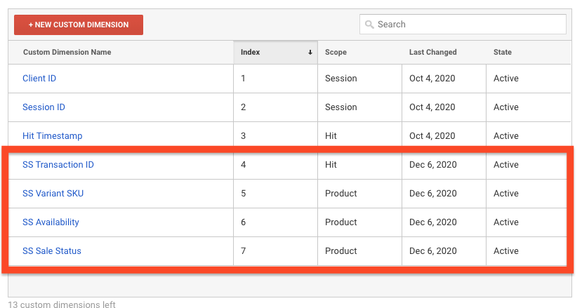
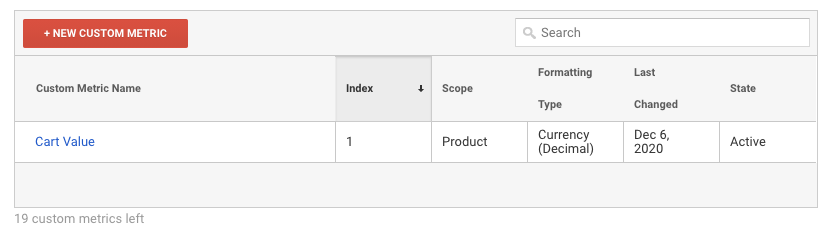
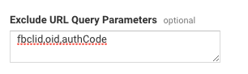
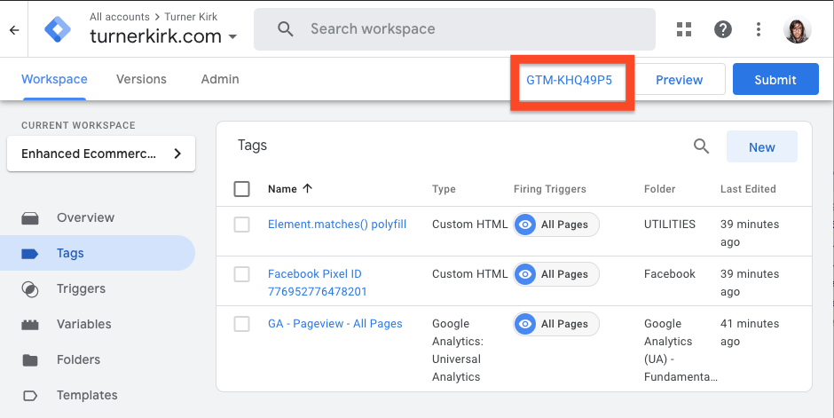
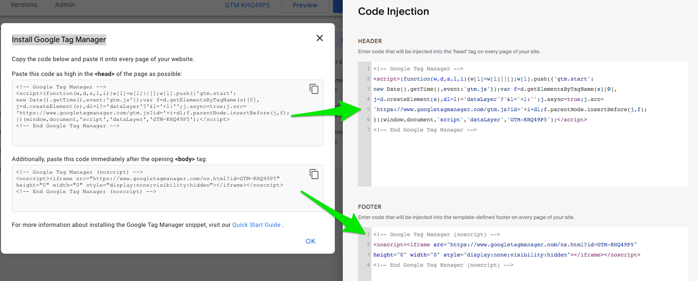
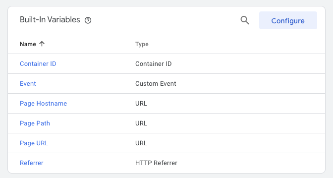
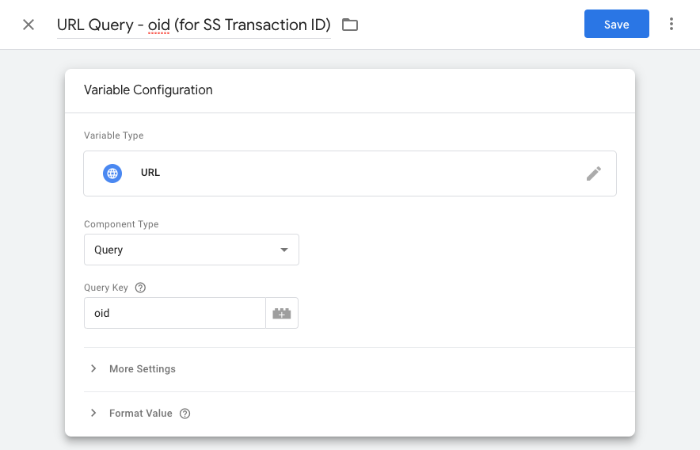
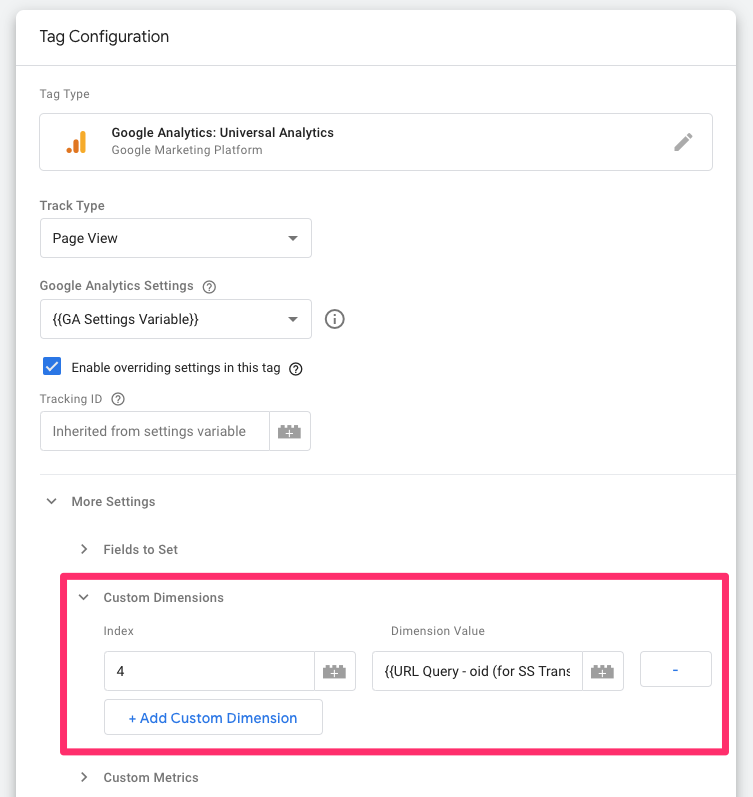
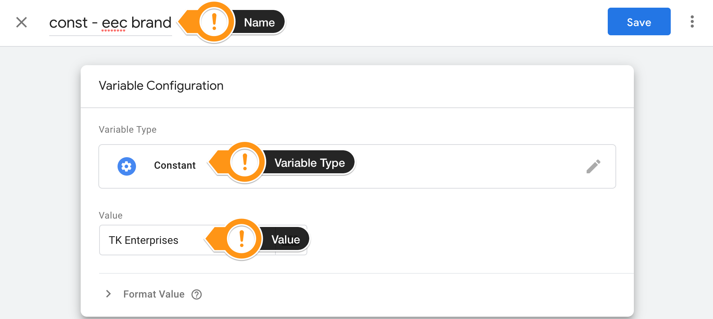
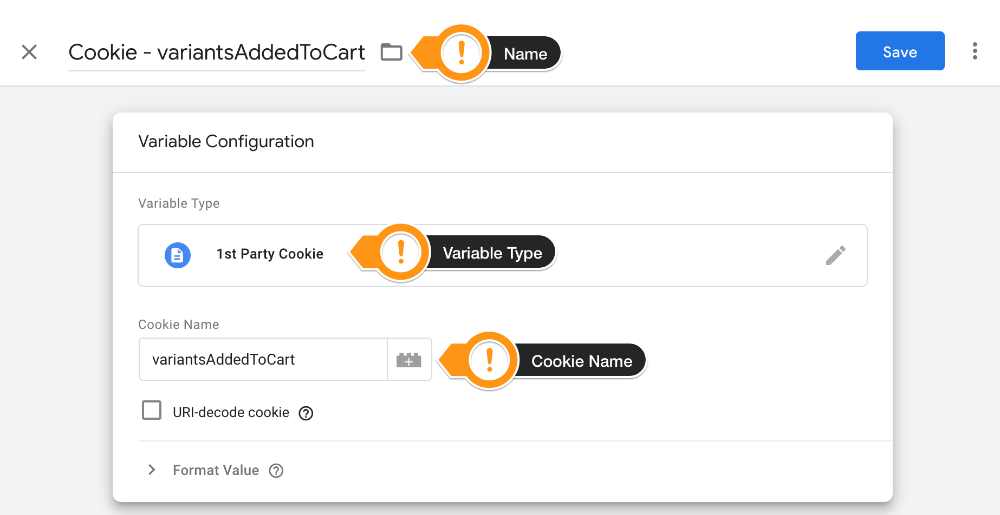

# SETTING UP GOOGLE ANALYTICS ENHANCED ECOMMERCE TRACKING ON SQUARESPACE
## Welcome
In this guide I will go step by step through the solution I've come up with for setting up Google Analytics Enhanced Ecommerce (EEC) Tracking in Squarespace. Currently this solution is specific to Universal Analytics. But adding GA4 Ecommerce support is trivial so I'll add a section on that soon.

## DISCLAIMER
**While I can say that I've written this guide after successfully setting up EEC Tracking on a couple different websites I manage, I cannot guarantee that all parts of this solution will function correctly for your specific Ecommerce Store on Squarespace. Considering the variety of store setups and templates that Squarespace offers, it's possible that some parts of this will not work. I want to make clear that setting up EEC is a somewhat complicated process no matter what platform it is being setup on and ideally requires an understanding of how to code with Javascript, and an understanding of how Google Tag Manager and the dataLayer function. If you are just getting started with either of these things, then perhaps this guide will act as a supplemental educational resource and provide a way to learn how these things work.**

## Additional Resources
If you are just getting started with GTM, I strongly encourage you read through [Simo Ahava's incredible guide to using Google Tag Manager to set-up Enhanced Ecommerce.](https://www.simoahava.com/analytics/enhanced-ecommerce-guide-for-google-tag-manager/) Simo Ahava is one of the world's leading experts (if not the leading one) on Google Tag Manager and he's also a prolific blogger. We are very lucky to have him.

And without further adoo, let's get started!

## Process
This Guide is organized roughly in the following structure:
1.  [Prepare Google Analytics Property and View Settings](#SECTION-1-PREPARE-GOOGLE-ANALYTICS-PROPERTY-AND-VIEW-SETTINGS)
2.  [Install Google Tag Manager (GTM) container code snippet on Squarespace (SS)](#SECTION-2-\-\--INSTALL-GTM-CONTAINER-CODE-SNIPPET-ON-SS)
3.  [Configure a variety of basic variables in GTM](#SECTION-3-\-\--CONFIGURE-THE-BASIC-BUILT\-IN-AND-USER\-DEFINED-VARIABLES)
4.  [Configure Custom JS Variables, HTML Tags, and SS Code Injections to generate EEC data structures](#SECTION-4-\-\--CONFIGURE-CUSTOM-JAVASCRIPT-VARIABLES,-HTML-TAGS,-AND-SS-CODE-INJECTIONS-TO-GENERATE-EEC-DATA-STRUCTURES): This section is the bulk of the work where we perform our EEC dataLayer manipulation and prepare our EEC data structures to be sent to Google Analytics. To do this we will create a variety of Custom Javascript Variables and HTML Tags in GTM as well as Code Injections in SS. The structure will mirror the user journey by implementing our 5 funnel steps in chronological order.
    1.  Product Detail Views
        1.  push raw data to dataLayer from SS Code Injection
        2.  transform into `detail` EEC data structure in GTM
    2.  Add To Cart
        1.  push raw data to dataLayer from SS "Add To Cart" event listener
        2.  transform into `add` EEC data structure
        3.  update `variantsAddedToCart` cookie
    3.  Modify Cart (add/remove items on the "/cart" page)
        1.  scrape cart info from page and push initial state to dataLayer
        2.  transform into `checkout` EEC data structure (if they don't modify the cart, the next step is checkout)
        3.  add MutationObserver to monitor changes to cart, if the cart state changes then re-scrape page for new cart state, compare old cart to new cart to identify which items were added or removed, transform into `add` or `remove` EEC data structure accordingly, and update our `checkout` EEC data structure
    4.  Checkout
        1.  setup trigger
    5.  Purchase
        1.  push to dataLayer from SS Code Injection
        2.  transform into `purchase` EEC data structure in GTM
5.  [Configure tag firing triggers](#SECTION-5-\-\--CONFIGURE-TAG-FIRING-TRIGGERS)
6.  [Configure EEC tags](#SECTION-6-\-\--CONFIGURE-EEC-TAGS)
7.  TEST IT THOROUGHLY

---
# SECTION 1: PREPARE GOOGLE ANALYTICS PROPERTY AND VIEW SETTINGS
## Property Settings
In Google Analytics, go to settings, and choose the property that will be used for EEC
   
1.  Under "Custom Definitions" choose "Custom Dimensions"

    We will need to setup 4 custom dimensions **(Don't worry if the indexes aren't the same as in the pictures):**
    *	`SS Transaction ID` - Hit Scoped - Value will be the Squarespace given transaction ID
    *	`SS Variant SKU`    - Product Scoped - Value will be the Squarespace given variant SKU
    *	`SS Availability`   - Product Scoped - Value will be either 'In Stock' or 'Sold Out'
    *	`SS Sale Status`    - Product Scoped - Value will be either 'On Sale' or 'Regular Price'

    

2.  Under "Custom Definitions" choose "Custom Metrics"
    
    We will need to setup 1 custom metric:
    *	`Cart Value` - Product Scoped - Currency (Decimal) - This will provide the combined value of products added or removed from cart

    

## View Settings
Now for the view settings. Repeat the following steps for each view that we want to enable EEC tracking on.
    
1.  Choose "View Settings" and under "Exclude URL Query Parameters" add `oid,authCode`
    
    

2.  Choose "Ecommerce Settings" and turn on both "Enable Ecommerce" and "Enable Enhanced Ecommerce Reporting". Don't worry about "Checkout Labeling" as we will not be able to do this anyways.
    
    

**That's it for Google Analytics. The rest of the work will happen in Google Tag Manager (GTM) and Squarespace (SS)**

# SECTION 2 -- INSTALL GTM CONTAINER CODE SNIPPET ON SS

I'll assume you've already setup a Google Tag Manager account and know how to use it, but you may not have set up Squarespace to work with Google Tag Manager.

1.  In GTM, click on your container ID to open up the "Install Google Tag Manager" window

    

2.  Leave this window open and in a new window open up Squarespace and go to "Settings -> Advanced -> Code Injection". Copy the code from the top box in GTM to the "Header" section in Squarespace and the code from the bottom box in GTM to the "Footer" section in Squarespace. Make sure to save changes in Squarespace

    

3.  If you haven't already, setup a pageview tag in Google Tag Manager to fire on an "All Pages" trigger
4.  Make sure to test that the integration is working.

# SECTION 3 -- CONFIGURE THE BASIC BUILT-IN AND USER-DEFINED VARIABLES
## A) Setup a few Built-in Variables
We will be using 4 built-in variables so we need to make sure they are configured
1.  Go to the variables sectoin of GTM, click "Configure" in the "Built-In Variables" section, and enable `Container ID`, `Event`, `Page Hostname`, and `Referrer` by checking the box next to them in the list.
    When you're done you should see these variables available in the "Built-In Variables" list

    

## B) Setup the first User-Defined Variable and modify our Pageview Tag
This is where it starts to get fun. We will be needing a bunch of custom variables, but let's start with an easy one to ease into things shall we?

1.  In the "User-Defined Variables" section, click "New" to start the custom variable creation process
2.  Name the variable `URL Query - oid (for SS Transaction ID)` 
    Choose the variable type "URL" 
    Set the "Component Type" to `Query` 
    Set the "Query Key" to `oid` 
    The point of this variable is to capture the Squarespace (SS) Transaction ID out of the URL Query Parameters whenever a customer finishes checkout and lands on the Checkout Complete page. Click save to complete the variable completion process.

    

3.  Now go to "Tags" and open the obligatory Pageview tag that is firing on "All Pages" (if you don't have one yet you should create one)
4.  Check the "Enable overriding settings in this tag" box
5.  Under "More Settings -> Custom Dimensions", choose "Add Custom Dimension"
6.  Set the Index to the same index as was generated for the custom dimension named `SS Transaction ID` that we created at the beginning of this tutorial in [**SECTION 1: Step 1**](#SECTION-1-PREPARE-GOOGLE-ANALYTICS-ACCOUNT)
7.  Set the "Dimension Value" to the variable we created in step 2 either by copying and pasting this exact text `{{URL Query - oid (for SS Transaction ID)}}` or clicking the icon next to the text box (looks like a lego block with a plus sign on it) and choosing the variable from the list.

    

8.  Don't forget to click the "save" button!

## C) Setup the other basic User-Defined Variables
Next we will setup a bunch of other User-Defined variables that are pretty straightforward. All of these variables will be created by clicking "New" in the "User-Defined Variables" section.

**NOTE: Naming variables exactly as they are listed in this guide is a crucial step in order for everything to work. Thankfully Google Tag Manager should complain if you accidentally name a variable incorrectly during the setup, but try not to do this. Once all of the code has been copied to the custom Javascript Variables later in this tutorial, you can re-name any of the variables to be whatever you want because GTM will update them anywhere they appear in the container. But I recommend just leaving them as-is.**

I'll provide a screenshot of the first one to show how to set them up and then rely on text for the rest.

**Constant Variable**
1.  Variable Name: `const - eec brand` 
    Variable Type: Constant 
    Value: "Your Brand Name" 

    

**1st Party Cookie Variable**
2.  Variable Name: `Cookie - variantsAddedToCart` 
    Variable Type: 1st Party Cookie 
    Cookie Name: `variantsAddedToCart` 

    

**Data Layer VERSION 1 Variable**
3.  Variable Name: `DL - SS Raw Modify Cart` 
    Variable Type: Data Layer Variable 
    Data Layer Variable Name: `ssRawModifyCart` 
    Data Layer Version: Version 1 

**Data Layer VERSION 2 Variables**
4.  Variable Name: `DL - SS Raw Product Detail` 
    Variable Type: Data Layer Variable 
    Data Layer Variable Name: `ssRawProductDetail` 
    Data Layer Version: Version 2 
    
5.  Variable Name: `DL - EEC Detail - Product Name` 
    Variable Type: Data Layer Variable 
    Data Layer Variable Name: `ssRawProductDetail.item.title` 
    Data Layer Version: Version 2 

6.  Variable Name: `DL - SS Raw Add To Cart` 
    Variable Type: Data Layer Variable 
    Data Layer Variable Name: `ssRawAddToCart` 
    Data Layer Version: Version 2 

7.  Variable Name: `DL - EEC Add - Quantity Added` 
    Variable Type: Data Layer Variable 
    Data Layer Variable Name: `ssRawAddToCart.quantityAdded` 
    Data Layer Version: Version 2 

8.  Variable Name: `DL - EEC Modify - action` 
    Variable Type: Data Layer Variable 
    Data Layer Variable Name: `modifyCartTagInfo.action` 
    Data Layer Version: Version 2 

9.  Variable Name: `DL - EEC Modify - productName` 
    Variable Type: Data Layer Variable 
    Data Layer Variable Name: `modifyCartTagInfo.productName` 
    Data Layer Version: Version 2 

10. Variable Name: `DL - EEC Modify - quantity` 
    Variable Type: Data Layer Variable 
    Data Layer Variable Name: `modifyCartTagInfo.quantity` 
    Data Layer Version: Version 2 

11. Variable Name: `DL - EEC Purchase - Order ID` 
    Variable Type: Data Layer Variable 
    Data Layer Variable Name: `ssRawTransaction.orderNumber` 
    Data Layer Version: Version 2 

12. Variable Name: `DL - EEC Purchase - Revenue` 
    Variable Type: Data Layer Variable 
    Data Layer Variable Name: `ssRawTransaction.grandTotal.decimalValue` 
    Data Layer Version: Version 2 

13. Variable Name: `DL - EEC Purchase - SS Transaction ID` 
    Variable Type: Data Layer Variable 
    Data Layer Variable Name: `ssRawTransaction.id` 
    Data Layer Version: Version 2 

14. Variable Name: `DL - SS Raw Transaction` 
    Variable Type: Data Layer Variable 
    Data Layer Variable Name: `ssRawTransaction` 
    Data Layer Version: Version 2 

15. Variable Name: `name_here` 
    Variable Type: Data Layer Variable 
    Data Layer Variable Name: `variable_here` 
    Data Layer Version: Version 2 

# SECTION 4 -- CONFIGURE CUSTOM JAVASCRIPT VARIABLES, HTML TAGS, AND SS CODE INJECTIONS TO GENERATE EEC DATA STRUCTURES

# SECTION 5 -- CONFIGURE TAG FIRING TRIGGERS

# SECTION 6 -- CONFIGURE EEC TAGS

