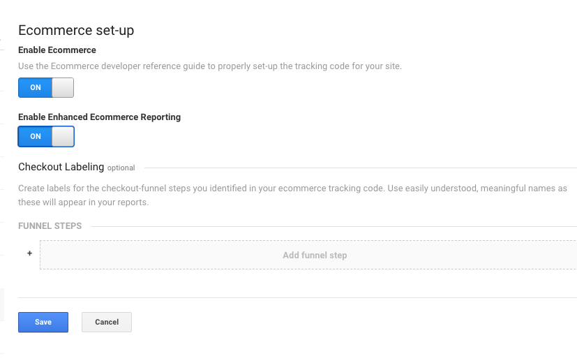

# SETTING UP GOOGLE ANALYTICS ENHANCED ECOMMERCE TRACKING ON SQUARESPACE
## Welcome
In this guide I will go step by step through the solution I've come up with for setting up the Google Analytics Enhanced Ecommerce (EEC) Tracking integration with Squarespace.

## DISCLAIMER
**While I can say that I've written this guide after successfully setting up EEC Tracking on a couple different websites I manage, I cannot guarantee that all parts of this solution will function correctly for your specific Ecommerce Store on Squarespace. Considering the variety of store setups and templates that Squarespace offers, it's possible that some parts of this will not work. I want to make clear that setting up EEC is a somewhat complicated process no matter what platform it is being setup on and ideally requires an understanding of how to code with Javascript, and an understanding of how Google Tag Manager and the dataLayer function. If you are just getting started with either of these things, then perhaps this guide will act as a supplemental educational resource and provide a way to learn how these things work.**

## Additional Resources
If you are just getting started with GTM, I strongly encourage you read through [Simo Ahava's incredible guide to using Google Tag Manager to set-up Enhanced Ecommerce.](https://www.simoahava.com/analytics/enhanced-ecommerce-guide-for-google-tag-manager/) Simo Ahava is one of the world's leading experts (if not the leading one) on Google Tag Manager and he's also a prolific blogger. We are very lucky to have him.

And without further adoo, let's get started!

## Process
This Guide is organized in the following structure:
1.  Prepare Google Analytics Property and View Settings
2.  Install Google Tag Manager (GTM) container code snippet on Squarespace (SS)
3.  Configure a variety of basic variables in GTM
4.  Create a variety of Custom Javascript Variables and HTML Tags in GTM as well as Code Injections in SS. These will be the meat and potatoes of the system that perform our EEC dataLayer manipulation and prepare our EEC data structures to be sent to Google Analytics
5.  Create our tag firing triggers
6.  Create our EEC tags
7.  TEST IT THOROUGHLY

# SECTION 1 -- PREPARE GOOGLE ANALYTICS ACCOUNT
## Property Settings
In Google Analytics, go to settings, and choose the property that will be used for EEC
   
1.  Under "Custom Definitions" choose "Custom Dimensions"

    We will need to setup 4 custom dimensions **(Don't worry if the indexes aren't the same as in the pictures):**
    *	`SS Transaction ID` - Hit Scoped - Value will be the Squarespace given transaction ID
    *	`SS Variant SKU`    - Product Scoped - Value will be the Squarespace given variant SKU
    *	`SS Availability`   - Product Scoped - Value will be either 'In Stock' or 'Sold Out'
    *	`SS Sale Status`    - Product Scoped - Value will be either 'On Sale' or 'Regular Price'

    

2.  Under "Custom Definitions" choose "Custom Metrics"
    
    We will need to setup 1 custom metric:
    *	`Cart Value` - Product Scoped - Currency (Decimal) - This will provide the combined value of products added or removed from cart

    

Now for the view settings. We will have to repeat the following steps for each view that we want to set up for EEC tracking.
    
1.  Choose "View Settings" and under "Exclude URL Query Parameters" add `oid,authCode`
    
    

2.  Choose "Ecommerce Settings" and turn on both "Enable Ecommerce" and "Enable Enhanced Ecommerce Reporting". Don't worry about "Checkout Labeling" as we will not be able to do this anyways.
    
    

**That's it for Google Analytics. The rest of the work will happen in Google Tag Manager (GTM) and Squarespace (SS)**

# SECTION 2 -- CONNECT GOOGLE TAG MANAGER AND SQUARESPACE

I'll assume you've already setup a Google Tag Manager account and know how to use it, but you may not have set up Squarespace to work with Google Tag Manager.

1.  In GTM, click on your container ID to open up the "Install Google Tag Manager" window

    

2.  Leave this window open and in a new window open up Squarespace and go to "Settings -> Advanced -> Code Injection". Copy the code from the top box in GTM to the "Header" section in Squarespace and the code from the bottom box in GTM to the "Footer" section in Squarespace. Make sure to save changes in Squarespace

    

3.  If you haven't already, setup a pageview tag in Google Tag Manager to fire on an "All Pages" trigger
4.  Make sure to test that the integration is working.

# SECTION 3 -- CONFIGURE THE BUILT-IN VARIABLES
We will be using 4 built-in variables so we need to make sure they are configured
1.  Go to the variables sectoin of GTM, click "Configure" in the "Built-In Variables" section, and enable `Container ID`, `Event`, `Page Hostname`, and `Referrer` by checking the box next to them in the list.

    

# SECTION 4 -- SETUP THE FIRST USER-DEFINED VARIABLE AND MODIFY PAGEVIEW TAG
This is where it starts to get fun. We will be needing a bunch of custom variables, but let's start with an easy one to ease into things shall we?

1.  In the "User-Defined Variables" section, click "New" to start the custom variable creation process
2.  Name the variable `URL Query - oid (for SS Transaction ID)` 

    **NOTE: Naming variables exactly as they are listed in this guide is a crucial step in order for everything to work. Thankfully Google Tag Manager should complain if you accidentally name a variable incorrectly during the setup, but try not to do this. Once all of the code has been copied to the custom Javascript Variables later in this tutorial, you can re-name any of the variables to be whatever you want because GTM will update them anywhere they appear in the container. But I recommend just leaving them as-is.**

3.  Choose the variable type "URL", set the "Component Type" to `Query` and the "Query Key" to `oid`. The point of this variable is to capture the Squarespace (SS) Transaction ID out of the URL Query Parameters whenever a customer finishes checkout and lands on the Checkout Complete page. Click save to complete the variable completion process.

    

4.  Now go to "Tags" and open the Pageview tag that is firing on "All Pages".
5.  Check the "Enable overriding settings in this tag" box
6.  Under "More Settings -> Custom Dimensions", choose "Add Custom Dimension"
7.  Set the Index to the same index as was generated for the custom dimension named `SS Transaction ID` that we created at the beginning of this tutorial in **SECTION 1: Step 1**
8.  Set the "Dimension Value" to the variable we just created either by copying and pasting this exact text `{{URL Query - oid (for SS Transaction ID)}}` or clicking the icon next to the text box (looks like a lego block with a plus sign on it) and choosing the variable from the list.

    

9.  Don't forget to click the "save" button!

# SECTION 5 -- SETUP THE OTHER SIMPLE USER-DEFINED VARIABLES
Next we will setup a bunch of other User-Defined variables that are pretty straightforward. All of these variables will be created by clicking "New" in the "User-Defined Variables" section.

I'll provide a screenshot of the first one to show how to set them up and then rely on text for the rest.

**Constant Variables**
1.  Variable Name: `const - eec brand`
    Variable Type: Constant
    Value: "Your Brand Name"

    

**1st Party Cookie Variables**
1.  Variable Name: `Cookie - variantsAddedToCart`
    Variable Type: 1st Party Cookie
    Cookie Name: `variantsAddedToCart`

    

**Data Layer VERSION 1 Variables**
1.  Variable Name: `DL - SS Raw Modify Cart`
    Variable Type: Data Layer Variable
    Data Layer Variable Name: `ssRawModifyCart`
    Data Layer Version: Version 1

**Data Layer VERSION 2 Variables**
4.  Variable Name: `DL - SS Raw Product Detail`
    Variable Type: Data Layer Variable
    Data Layer Variable Name: `ssRawProductDetail`
    Data Layer Version: Version 2
    
5.  Variable Name: `DL - EEC Detail - Product Name`
    Variable Type: Data Layer Variable
    Data Layer Variable Name: `ssRawProductDetail.item.title`
    Data Layer Version: Version 2

6.  Variable Name: `DL - SS Raw Add To Cart`
    Variable Type: Data Layer Variable
    Data Layer Variable Name: `ssRawAddToCart`
    Data Layer Version: Version 2

7.  Variable Name: `DL - EEC Add - Quantity Added`
    Variable Type: Data Layer Variable
    Data Layer Variable Name: `ssRawAddToCart.quantityAdded`
    Data Layer Version: Version 2

8.  Variable Name: `DL - EEC Modify - action`
    Variable Type: Data Layer Variable
    Data Layer Variable Name: `modifyCartTagInfo.action`
    Data Layer Version: Version 2

9.  Variable Name: `DL - EEC Modify - productName`
    Variable Type: Data Layer Variable
    Data Layer Variable Name: `modifyCartTagInfo.productName`
    Data Layer Version: Version 2

10. Variable Name: `DL - EEC Modify - quantity`
    Variable Type: Data Layer Variable
    Data Layer Variable Name: `modifyCartTagInfo.quantity`
    Data Layer Version: Version 2

11. Variable Name: `DL - EEC Purchase - Order ID`
    Variable Type: Data Layer Variable
    Data Layer Variable Name: `ssRawTransaction.orderNumber`
    Data Layer Version: Version 2

12. Variable Name: `DL - EEC Purchase - Revenue`
    Variable Type: Data Layer Variable
    Data Layer Variable Name: `ssRawTransaction.grandTotal.decimalValue`
    Data Layer Version: Version 2

13. Variable Name: `DL - EEC Purchase - SS Transaction ID`
    Variable Type: Data Layer Variable
    Data Layer Variable Name: `ssRawTransaction.id`
    Data Layer Version: Version 2

14. Variable Name: `DL - SS Raw Transaction`
    Variable Type: Data Layer Variable
    Data Layer Variable Name: `ssRawTransaction`
    Data Layer Version: Version 2

15. Variable Name: `name_here`
    Variable Type: Data Layer Variable
    Data Layer Variable Name: `variable_here`
    Data Layer Version: Version 2
