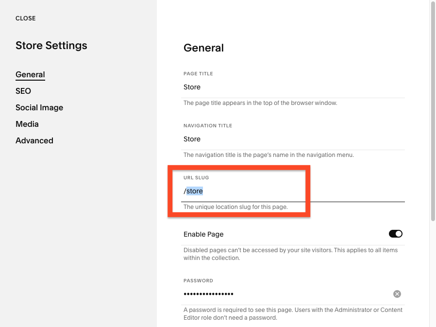

# IMPLEMENTATION GUIDE FOR THE "DETAIL" EEC ACTION

1. Implement a SS Code Injection script to push raw item viewed data to dataLayer
    1. In Squarespace, navigate to "Settings -> Advanced -> Code Injection" 
    2. Copy [this code][01_datalayer_push_code] to the "Footer" section BELOW the GTM container snippet
    3. Find the line of code just below the opening `<script>` tag that looks like this `var storePageName = "store";`
    4. Change the word between the quotes (currently set to `store`) to the URL path name of your store, which can be found in the "Store Settings" box.
       1. To find this go to "Pages" and then clicking the gear icon next to your store page.
       2. The path name for your store is the text after the "/" in the text field labeled "URL SLUG". It is case sensitive so make sure not to change the case of any letters. See the image below.
      
      

    5. Once you've updated the path in the script tag on the Code Injection page, click "save" to save the changes
    6. back in GTM, start Preview mode to test if it's working. Anytime we visit a product detail page, we should see the event `ssRawProductDetailPush` show up in the Summary tab and the DataLayer variable `DL - SS Raw Product Detail` we created previously should populate. This information is being pulled directly from the `Static.SQUARESPACE_CONTEXT` object which you can inspect using your browser's console.
    
    
    


2. Use a Custom Javascript Variable to transform the raw data into a `productJSON` and then generate our `detail` EEC data structure (add the actionField with list name if applicable)
    1. Create a Custom Javascript Variable and name it `JS - eec.detail`
    2. Copy [this code][02_eec_object_creation_code] to the "Custom JavaScript" section
    3. Save the variable
    4. To test this, re-start Preview mode in GTM and visit a product details page. Now we should see the `JS - eec.detail` variable populate with a properly formatted EEC Object. See below for an example of what this looks like.


    

<br/>
<br/>
<br/>

**EEC DETAIL DATA STRUCTURE REFERENCE**<br/>
This is an example of what an EEC data structure for action of type `detail` looks like. Notice there's no SKU on the detail view because there may be more than one variant

```
{
  'ecommerce': {
    'detail': {
      'products': [
        {
          'id': '399sdccsfjl8990933kkj3jkl3',
          'name': 'product name',
          'category': 'categoryA/categoryB',
          'brand': 'Your Brand Name',
          'price': '6.00',
          'dimension6': 'In Stock',
          'dimension7': 'On Sale'
        }
      ],
      'actionField': {'list': 'The List Name'}
    }
  }
}
```


[01_datalayer_push_code]: ./01_ss_rawProductDetailPush.html
[02_eec_object_creation_code]: ./02_gtm_eecDetailObj.js
