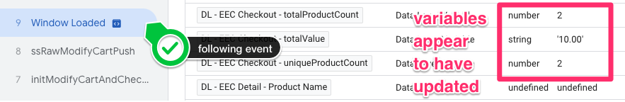

# IMPLEMENTATION GUIDE FOR THE "CHECKOUT" EEC ACTION

1. Use a Custom Javascript Variable to transform the current cart's items list into a list of `productJSON` objects and quantities, and then generate our `checkout` EEC data structure out of these lists (including the actionField with {'step':1})
    1. Create a Custom Javascript Variable and name it `JS - eec.checkout`
    2. Copy [this code][02_eec_object_creation_code] to the "Custom JavaScript" section
    3. Save the variable
    4. To test this, re-start Preview mode in GTM, add a product to cart and visit the cart page (or just visit the cart page if items are already in the cart)<br/>
    After the `ssRawModifyCartPush` event shows up in the "Summary" tab, the `JS - eec.checkout` variable should be populated to reflect the initial state of the cart<br/>
    We should ALSO see the `DL - EEC Checkout - uniqueProductCount`, `DL - EEC Checkout - totalProductCount`, and `DL - EEC Checkout - totalValue` variables initialized with their corresponding values.<br/>
    On `ssRawModifyCartPush` variables appear not to be populated correctly (but they actually are):<br/>
    <br/>
    <br/>
    On the event right after `ssRawModifyCartPush` variables appear to be updated:<br/>
    <br/>
    <br/>
    Once we modify the cart and the `fireModifyCartTag` event shows up in the "Summary" tab, the `JS - eec.checkout` object should update to reflect the new state of the cart. Either the quantity of of one of the items should have changed, or if an item was removed entirely, it should no longer be present in  the `JS - eec.checkout` object. If all items were removed, the object will look empty.


**EEC CHECKOUT DATA STRUCTURE REFERENCE**<br/>
This is an example of what the EEC data structure for action of type `checkout` looks like with 2 products.

```
{
  'ecommerce': {
    'checkout': {
      'products': [
        {
          'id': '399sdccsfjl8990933kkj3jkl3',
          'name': 'added product name',
          'category': 'categoryA/categoryB',
          'brand': 'Your Brand Name',
          'variant': 'option1|option2',
          'quantity': 2,
          'dimension5': 'SQ1234567',
          'price': '6.00',
          'dimension6': 'In Stock',
          'dimension7': 'On Sale'
        },
        {
          'id': '44222adf0989dfdfdf9992kjkljkj',
          'name': 'another added product name',
          'category': 'categoryC/categoryD',
          'brand': 'Your Brand Name',
          'variant': 'option1|option2',
          'quantity': 4,
          'dimension5': 'SQ7654321',
          'price': '10.00',
          'dimension6': 'In Stock',
          'dimension7': 'Regular Price'
        }
      ],
      'actionField': {'step': 1}
    }
  }
}
```


[02_eec_object_creation_code]: ./02_gtm_eecCheckoutObj.js
