# GUIDE: ENHANCED ECOMMERCE FOR SQUARESPACE
## Welcome
In this guide I will go step by step through the solution I've come up with for setting up Google Analytics Enhanced Ecommerce (EEC) features in Squarespace. Currently this solution only covers the Universal Analytics implementation but I've structured the implementation in a way that makes it almost trivial to add GA4 ecommerce tags as Google continues to build out that functionality.

## DISCLAIMER
**While I can say that I've written this guide after successfully setting up EEC Tracking on a couple different websites I manage, I cannot guarantee that all parts of this solution will function correctly for your specific Ecommerce Store on Squarespace. Considering the variety of store setups and templates that Squarespace offers, it's possible that some parts of this will not work. I want to make clear that setting up EEC is a somewhat complicated process no matter what platform it is being setup on and ideally requires an understanding of how to code with Javascript, and an understanding of how Google Tag Manager and the dataLayer function. If you are just getting started with either of these things, then perhaps this guide will act as a supplemental educational resource and provide a way to learn how these things work.**

## KNOWN ISSUES
Currently this implementation doesn't work with the "Quick View" feature in Squarespace Stores. So you will have to disable "Quick View" in Store Settings before following this guide. Personally I think "Quick View" is not the greatest feature and I've noticed Squarespace's implementation appears to have some bugs. 
    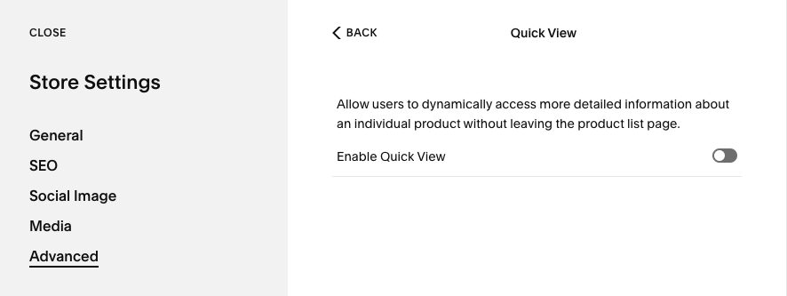

## Additional Resources
Simo Ahava is one of the world's leading experts (if not the leading one) on Google Tag Manager and other Google Properties. He's also a prolific blogger. We are very lucky to have him. If you are just getting started with GTM, I strongly encourage you read through as much of his blog as possible.
Here are the most relevant of his articles:
* [Simo Ahava: The difinitive Enhanced Ecommerce guide for Google Tag Manager](https://www.simoahava.com/analytics/enhanced-ecommerce-guide-for-google-tag-manager/)

And without further ado, let's dive in!

# OVERVIEW
Before we get started it is important to point out exactly which parts of the EEC specification are going to be implemented, and which parts are not. I think you'll find that the majority of what you want is covered in this guide and the parts that are not covered are a LOT more effort than they are likely worth.

### Enhanced Ecommerce features we will be implementing:
**ACTIONS**
1. Product Detail Views
2. Add To Cart (from product detail page)
3. Add/Remove from cart (when customers make modifications to the cart)
4. Checkout Step 1 (when a customer clicks the "CHECKOUT" button)
5. Purchase

**PRODUCT DATA** 
The following Product Data will be sent (when applicable) along with each of the above actions:
* ID
* Name
* Category
* Variant
* Price
* Quantity

**CUSTOM DIMENSIONS** 
* Squarespace Transaction ID - purchase only (this is different from the Order ID which we will be sending as the ID of the EEC Purchase object's "actionField")
* Product Variant Sku - add/remove, checkout, purchase
* Product Availability - all actions although it's really only super useful for Product Detail Views. value will be "In Stock" or "Out Of Stock" 
* Product On Sale or Not - all actions

**CUSTOM METRIC** 
* Total Cart Value - allows for comparison of the total value of products added to cart vs. actual product revenue. Check out [Simo Ahava's blog post](https://www.simoahava.com/analytics/measure-cart-value-in-enhanced-ecommerce/) on the subject if you're curious why we all should be doing this.

### Enhanced Ecommerce features we will NOT be implementing:
1. Product Impressions
2. Product Clicks
3. Promotion Impressions
4. Promotion Clicks
5. Coupon Codes
6. Refunds

The way Squarespace is set up and the way we are implementing EEC makes it difficult to implement these features. If you figure out how to do it though I would LOVE for you to share your solution in the [discussion section of this repository!](https://github.com/EfficiencyJunky/eec-for-squarespace/discussions)

## Table of Contents
1.  [Prepare Google Analytics Property and View Settings](#SECTION-1-PREPARE-GOOGLE-ANALYTICS-PROPERTY-AND-VIEW-SETTINGS)
2.  [Install Google Tag Manager (GTM) container code snippet on Squarespace (SS)](#SECTION-2-\-\--INSTALL-GTM-CONTAINER-CODE-SNIPPET-ON-SS)
3.  [Configure basic Built-In and User-Defined variables in GTM](#SECTION-3-\-\--CONFIGURE-BASIC-BUILT\-IN-AND-USER\-DEFINED-VARIABLES)
4.  [Configure Custom JavaScript Variable Utilities to be used throughout our implementation](#SECTION-4-\-\--CONFIGURE-CUSTOM-JAVASCRIPT-VARIABLE-UTILITY-FUNCTIONS)
5.  [Configure Custom JavaScript Variables, HTML Tags, and SS Code Injections to generate EEC data structures](#SECTION-5-\-\--CONFIGURE-SS-CODE-INJECTIONS-HTML-TAGS-AND-CUSTOM-JAVASCRIPT-VARIABLES-TO-GENERATE-EEC-DATA-STRUCTURES) 
    This section is the bulk of the work where we perform our EEC dataLayer manipulation and prepare our EEC data structures to be sent to Google Analytics. 
    To do this we will create a variety of Custom JavaScript Variables and Custom HTML Tags (with Javascript code) in GTM, AND a couple Code Injections in SS. 
    The order of our implementation will mirror the user journey through the 5 funnel steps. 
    1.  [Product Detail Views](#1-Product-Detail-Views)
        1.  push raw data to dataLayer (from SS Code Injection)
        2.  transform into `productJSON` data structure
        3.  generate `detail` EEC data structure
    2.  [Add To Cart](#2-Add-To-Cart)
        1.  push raw data to dataLayer (from SS "Add To Cart" event listener in Custom HTML Tag)
        2.  transform into `productJSON` data structure
        3.  update `variantsAddedToCart` cookie
        4.  generate `add` EEC data structure
    3.  [Modify Cart (add/remove items on the "/cart" page)](#3-Modify-Cart-addremove-items-on-the-cart-page)
        1.  scrape cart info from page and push initial cart state to dataLayer (Custom HTML Tag)
        2.  set-up a MutationObserver to monitor changes to cart and if the cart state changes:
            1.  re-scrape the page for new cart state
            2.  transform the lists of oldCartItems (original cart state) and newCartItems (updated cart state) into two objects with references to a `productJSON` data structure for each product present in the cart
            3.  identify which products were added or removed by comparing the two sets
            4.  generate `add` or `remove` EEC data structure accordingly
    4.  [Checkout](#4-Checkout)
        1.  transform the raw cart state from the dataLayer push of the previous step into a list of `productJSON` data structures
        2.  generate `checkout` EEC data structure
    5.  [Purchase](#5-Purchase)
        1.  push raw data to dataLayer (from SS Code Injection)
        2.  transform into `productJSON` data structure
        3.  generate `purchase` EEC data structure
6.  [Configure tag firing triggers](#SECTION-6-\-\--CONFIGURE-TAG-FIRING-TRIGGERS)
7.  [Configure EEC tags](#SECTION-7-\-\--CONFIGURE-EEC-TAGS)
8.  [TEST IT THOROUGHLY](#SECTION-8-\-\--CELEBRATENO-WAITTEST-EVERYTHING-FIRST)

---
# SECTION 1: PREPARE GOOGLE ANALYTICS PROPERTY AND VIEW SETTINGS
## Property Settings
In Google Analytics, go to settings, and choose the property that will be used for EEC
   
1.  Under "Custom Definitions" choose "Custom Dimensions"

    We will need to setup 4 custom dimensions **(Don't worry if the indexes aren't the same as in the pictures):**
    *	`SS Transaction ID` - Hit Scoped - Value set to the Squarespace alphanumeric transaction ID
    *	`SS Variant SKU`    - Product Scoped - Value set to the Squarespace variant SKU
    *	`SS Availability`   - Product Scoped - Value set to either 'In Stock' or 'Sold Out'
    *	`SS Sale Status`    - Product Scoped - Value set to either 'On Sale' or 'Regular Price'

    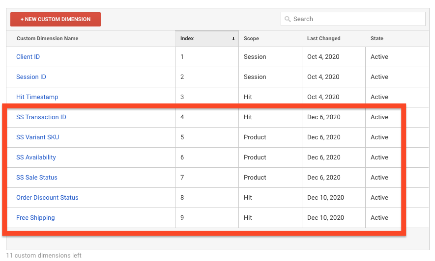

2.  Under "Custom Definitions" choose "Custom Metrics"
    
    We will need to setup 1 custom metric:
    *	`Cart Value` - Product Scoped - Currency (Decimal)

    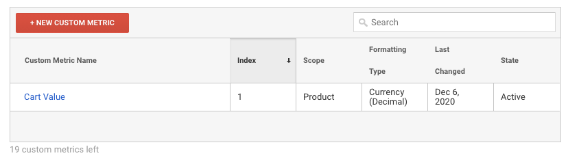

## View Settings
Now for the view settings. Repeat the following steps for each view that we want to enable EEC tracking on.
    
1.  Choose "View Settings" and under "Exclude URL Query Parameters" add `oid,authCode`
    
    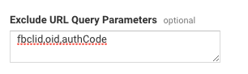

2.  Choose "Ecommerce Settings" and turn on both "Enable Ecommerce" and "Enable Enhanced Ecommerce Reporting". Don't worry about "Checkout Labeling" as we will not be able to do this anyways.
    
    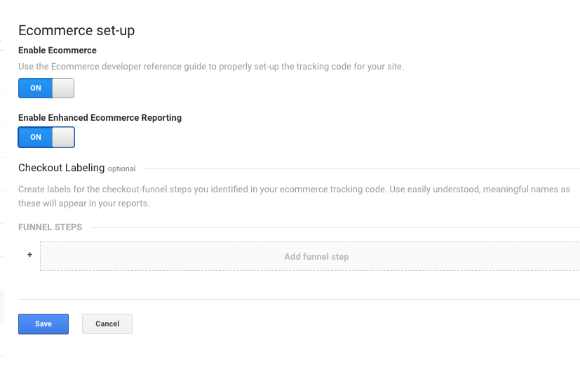

**That's it for Google Analytics. The rest of the work will happen in Google Tag Manager (GTM) and Squarespace (SS)**

---
# SECTION 2 -- INSTALL GTM CONTAINER CODE SNIPPET ON SS

I'll assume you've already setup a Google Tag Manager account and know how to use it, but you may not have set up Squarespace to work with Google Tag Manager.

1.  In GTM, click on your container ID to open up the "Install Google Tag Manager" window

    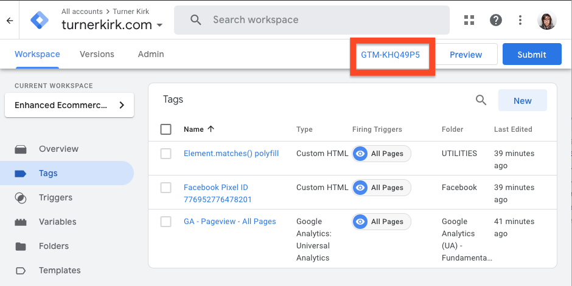

2.  Leave this window open and in a new window open up Squarespace and go to "Settings -> Advanced -> Code Injection". Copy the code from the top box in GTM to the "Header" section in Squarespace and the code from the bottom box in GTM to the "Footer" section in Squarespace. Make sure to save changes in Squarespace

    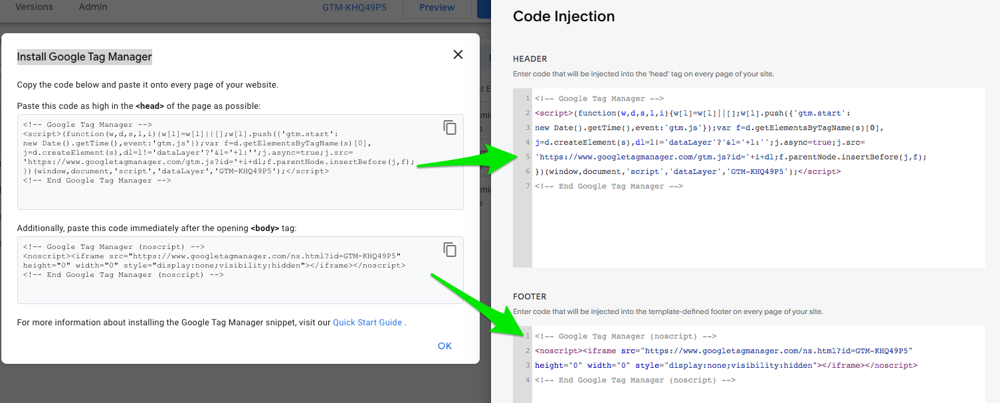

3.  If you haven't already, setup a pageview tag in Google Tag Manager to fire on an "All Pages" trigger
4.  Now put GTM into Preview Mode to test your changes. If everything is working, you should see pageviews firing in Google Analytics Realtime Reports when you visit your website. If you are new to Google Tag Manager then be warned that only YOU will be able to trigger pageviews until you Submit the changes in GTM.

---
# SECTION 3 -- CONFIGURE BASIC BUILT-IN AND USER-DEFINED VARIABLES
## Built-in Variables
We need to make sure the Built-in variables we will be using are configured if they haven't been already

1.  Go to the variables section of GTM, in the "Built-In Variables" section click "Configure" and enable `Container ID`, `Event`, `Page Hostname`, `Page Path`, `Page URL`, `Referrer`, and `Click Text` by checking the box next to them in the list. 
    If these variables are already enabled then you don't need to do this step. 
    When you're done you should see the variables available in the "Built-In Variables" list

    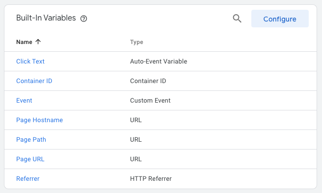

## Setup a User-Defined Variable and modify the Pageview Tag
This is where it starts to get fun. We will require a bunch of custom variables, but let's start with an easy one to get our feet wet.

1.  In the "User-Defined Variables" section, click "New" to start the custom variable creation process
2.  Name the variable `URL Query - oid (for SS Transaction ID)` 
    Choose the variable type "URL" 
    Set the "Component Type" to `Query` 
    Set the "Query Key" to `oid` 
    The point of this variable is to capture the Squarespace (SS) Transaction ID out of the URL Query Parameters whenever a customer finishes checkout and lands on the Checkout Complete page. Click save to complete the variable creation process.

    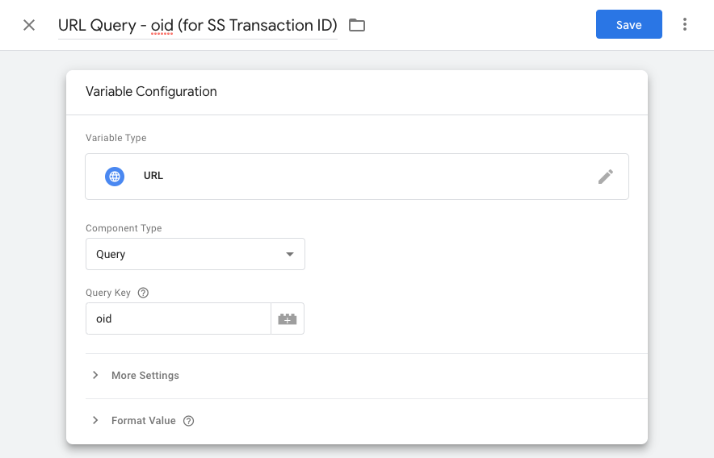

3.  Now go to "Tags" and open the obligatory Pageview tag that is firing on "All Pages"
4.  Check the box labeled "Enable overriding settings in this tag"
5.  Under "More Settings -> Custom Dimensions", choose "Add Custom Dimension"
6.  Set the Index to the same index as was generated for the custom dimension named `SS Transaction ID` that we created at the beginning of this tutorial in [**SECTION 1: Step 1**](#SECTION-1-PREPARE-GOOGLE-ANALYTICS-PROPERTY-AND-VIEW-SETTINGS) 
(in all of the examples throughout this guide we are using `dimension4` for the SS Transaction ID. If you are also using `dimension4` then you would put `4` in the index section)
7.  Set the "Dimension Value" to the variable we created in step 2 either by copying and pasting this exact text `{{URL Query - oid (for SS Transaction ID)}}` or by clicking the icon next to the text box (looks like a lego block with a plus sign on it) and choosing the variable from the list.

    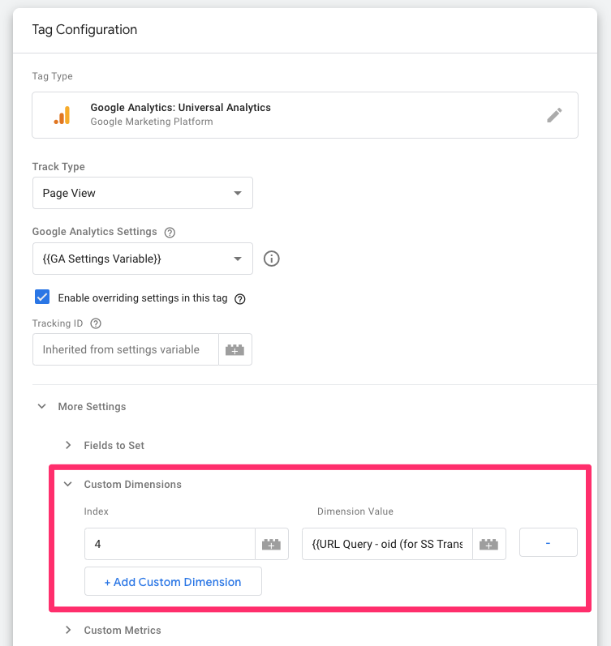

8.  Don't forget to click the "save" button!

Now when someone completes a checkout, our dataLayer variable will be populated with the Squarespace Transaction ID from the `oid` query parameter (which should only actually appear on pages who's path is `/checkout/order-confirmed`), and this will be sent along with the pageview hit as custom dimension4. Of course in Google Analytics Reports it will show up as "SS Transaction ID" under Custom Dimensions.

## Setup the other basic User-Defined Variables
Next we will setup a bunch of other User-Defined variables that are pretty straightforward. All of these variables will be created by clicking "New" in the "User-Defined Variables" section.

**NOTE: Naming variables exactly as they are listed in this guide is a crucial step in order for everything to work. Google Tag Manager may or may not complain if you accidentally name a variable incorrectly during the setup, but no guarantees. Once all of the code has been copied to the Custom JavaScript Variables later in this tutorial, you can re-name any of the variables to be whatever you want because GTM will update them anywhere they appear in the container. But I recommend just leaving them as-is.**

I'll provide a screenshot of the first one to show how to set them up.

**Constant Variables**

1.  Variable Name: `const - eec brand` 
    Variable Type: Constant 
    Value: "Your Brand Name" 

    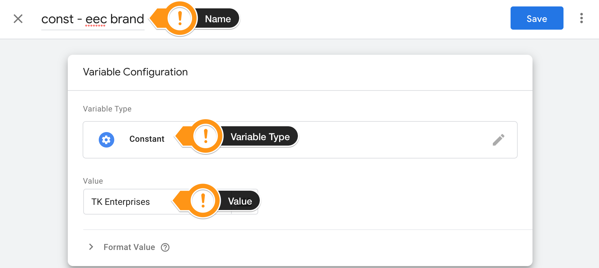

**1st Party Cookie Variables**

1.  Variable Name: `Cookie - variantsAddedToCart` 
    Variable Type: 1st Party Cookie 
    Cookie Name: `variantsAddedToCart` 

    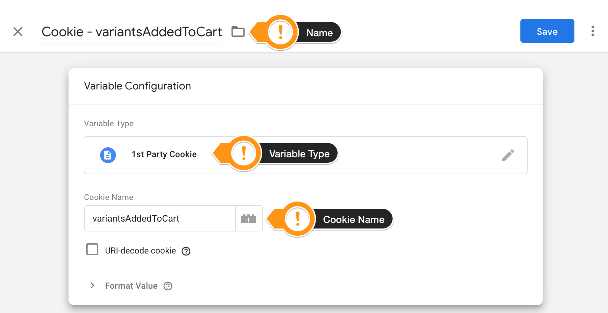

**Data Layer VERSION 1 Variable** 
NOTE: It is imperative that this variable be setup as "VERSION 1", otherwise the cart modification functions won't work correctly 
For more information on variable versions and recursive merge when pushing to dataLayer, see [Simo Ahava's article on the subject](https://www.simoahava.com/gtm-tips/data-layer-variable-versions-explained/)

1.  Variable Name: `DL - SS Raw Modify Cart` 
    Variable Type: Data Layer Variable 
    Data Layer Variable Name: `ssRawModifyCart` 
    **Data Layer Version: Version 1** 

**Data Layer VERSION 2 Variables**

1.  Variable Name: `DL - SS Raw Product Detail` 
    Variable Type: Data Layer Variable 
    Data Layer Variable Name: `ssRawProductDetail` 
    Data Layer Version: Version 2 
    
2.  Variable Name: `DL - EEC Detail - Product Name` 
    Variable Type: Data Layer Variable 
    Data Layer Variable Name: `ssRawProductDetail.item.title` 
    Data Layer Version: Version 2 

3.  Variable Name: `DL - SS Raw Add To Cart` 
    Variable Type: Data Layer Variable 
    Data Layer Variable Name: `ssRawAddToCart` 
    Data Layer Version: Version 2 

4.  Variable Name: `DL - EEC Add - Quantity Added` 
    Variable Type: Data Layer Variable 
    Data Layer Variable Name: `ssRawAddToCart.quantityAdded` 
    Data Layer Version: Version 2 

5.  Variable Name: `DL - EEC Modify - action` 
    Variable Type: Data Layer Variable 
    Data Layer Variable Name: `modifyCartTagInfo.action` 
    Data Layer Version: Version 2 

6.  Variable Name: `DL - EEC Modify - productName` 
    Variable Type: Data Layer Variable 
    Data Layer Variable Name: `modifyCartTagInfo.productName` 
    Data Layer Version: Version 2 

7. Variable Name: `DL - EEC Modify - quantity` 
    Variable Type: Data Layer Variable 
    Data Layer Variable Name: `modifyCartTagInfo.quantity` 
    Data Layer Version: Version 2 

8. Variable Name: `DL - EEC Checkout - uniqueProductCount` 
    Variable Type: Data Layer Variable 
    Data Layer Variable Name: `checkoutTagInfo.uniqueProductCount` 
    Data Layer Version: Version 2 

9. Variable Name: `DL - EEC Checkout - totalProductCount` 
    Variable Type: Data Layer Variable 
    Data Layer Variable Name: `checkoutTagInfo.totalProductCount` 
    Data Layer Version: Version 2 

10. Variable Name: `DL - EEC Checkout - totalValue` 
    Variable Type: Data Layer Variable 
    Data Layer Variable Name: `checkoutTagInfo.totalValue` 
    Data Layer Version: Version 2 

11. Variable Name: `DL - EEC Purchase - Order ID` 
    Variable Type: Data Layer Variable 
    Data Layer Variable Name: `ssRawTransaction.orderNumber` 
    Data Layer Version: Version 2 

12. Variable Name: `DL - EEC Purchase - Revenue` 
    Variable Type: Data Layer Variable 
    Data Layer Variable Name: `ssRawTransaction.grandTotal.decimalValue` 
    Data Layer Version: Version 2 

13. Variable Name: `DL - EEC Purchase - SS Transaction ID` 
    Variable Type: Data Layer Variable 
    Data Layer Variable Name: `ssRawTransaction.id` 
    Data Layer Version: Version 2 

14. Variable Name: `DL - SS Raw Transaction` 
    Variable Type: Data Layer Variable 
    Data Layer Variable Name: `ssRawTransaction` 
    Data Layer Version: Version 2 

---
# SECTION 4 -- CONFIGURE CUSTOM JAVASCRIPT VARIABLE UTILITY FUNCTIONS
Now we will start playing with code. YAY FINALLY!!! 

The purpose of this section is to set up a few Custom JavaScript Variables we will label as Utilites. A Utility is just what we call a Custom JavaScript Variable that returns a function instead of a value. This allows us to call the function from other Custom JavaScript Variables or Custom HTML Tags in Google Tag Manager.

The process for each of these will be the same: 

1.  create a new variable of type "Custom JavaScript", 
2.  give it the name specified by "Variable Name"
3.  copy and paste in the code from the file specified by "Code"

Each code file is liberally commented to explain what it does.

**Custom JavaScript Variables**

1.  Variable Name: `JS Utility - setCookie` 
    Code: [setCookie.js](./utilities/setCookie.js) 

2.  Variable Name: `JS Utility - updateVariantsAddedToCartCookie` 
    Code: [updateVariantsAddedToCartCookie.js](./utilities/updateVariantsAddedToCartCookie.js) 

3.  Variable Name: `JS Utility - setDataLayerVariable` 
    Code: [setDataLayerVariable.js](./utilities/setDataLayerVariable.js) 

4.  Variable Name: `JS Utility - parseURI` 
    Code: [parseURI.js](./utilities/parseURI.js) 

5.  Variable Name: `JS Utility - getCartItemsListFromScriptInDocument` 
    Code: [getCartItemsListFromScriptInDocument.js](./utilities/getCartItemsListFromScriptInDocument.js) 

6.  Variable Name: `JS Utility - convertRawCartItemsListToProductJsonCollection` 
    Code: [convertRawCartItemsListToProductJsonCollection.js](./utilities/convertRawCartItemsListToProductJsonCollection.js) 

7.  Variable Name: `JS Utility - createEecObjectFromAction` 
    Code: [createEecObjectFromAction.js](./utilities/createEecObjectFromAction.js) 

8.  Variable Name: `JS Utility - addListFromReferrer` 
    Code: [addListFromReferrer.js](./utilities/addListFromReferrer.js) 

---
# SECTION 5 -- CONFIGURE SS CODE INJECTIONS, HTML TAGS, AND CUSTOM JAVASCRIPT VARIABLES TO GENERATE EEC DATA STRUCTURES
These are the most time consuming and complicated steps. They will require code to be added to Code Injections in SS as well as Custom HTML Tags and Custom JavaScript Variables in GTM. Because of the added complexity, I've broken them out into separate subfolders that contain the implementation instructions and code for each step.

Click on a step to visit that step's subfolder:

### 1) [Product Detail Views](./02_detail/)
### 2) [Add To Cart](./03_add/)
### 3) [Modify Cart](./04_modify_cart/) (add/remove items on the /cart page)
### 4) [Checkout](./05_checkout/)
### 5) [Purchase](./06_purchase/)

---
# SECTION 6 -- CONFIGURE TAG FIRING TRIGGERS
Before we complete the final step of setting up our tags, we need to configure the triggers that will actually cause the tags to fire. Luckily, all but one of our triggers is based on an event we are pushing to dataLayer so this is a super easy process.

The process for each of these will be the same: 

1.  from the "Triggers" page in GTM choose "New" 
2.  give it the name specified by "Trigger Name"
3.  choose the trigger type indicated by "Trigger Type"
4.  fill in the trigger parameter fields as indicated by "Trigger Parameters"
5.  Choose the radio button indicated by "This trigger fires on"

**Triggers**
1. **Product Detail View TRIGGER**
   * Trigger Name: `custom event - ssRawProductDetailPush`
   * Trigger Type: Custom Event
   * Trigger Parameters
     * Event Name: `ssRawProductDetailPush`
     * This trigger fires on: `All Custom Events`

2. **Add To Cart TRIGGER**
   * Trigger Name: `custom event - ssRawAddToCartPush`
   * Trigger Type: Custom Event
   * Trigger Parameters
     * Event Name: `ssRawAddToCartPush`
     * This trigger fires on: `All Custom Events`

3. **Modify Cart TRIGGER**
   * Trigger Name: `custom event - fireModifyCartTag`
   * Trigger Type: Custom Event
   * Trigger Parameters
     * Event Name: `fireModifyCartTag`
     * This trigger fires on: `All Custom Events`

4. **Checkout TRIGGER**
   * Trigger Name: `click - CHECKOUT button`
   * Trigger Type: Click - All Elements
   * Trigger Parameters
     * This trigger fires on: `Some Clicks`
     * Condition 1: Select "Page Path" in the first dropdown, "contains" in the second, type `/cart` into the text field and then click the "+" button to the right of the text field
     * Condition 2: Select "Click Text" in the first dropdown, "contains" in the second and then type `CHECKOUT` into the text field. 
     **NOTE: If your CHECKOUT button is in another language or says something other than "CHECKOUT" you will need to type that into the text box instead**

5. **Purchase TRIGGER**
   * Trigger Name: `custom event - ssRawTransactionPush`
   * Trigger Type: Custom Event
   * Trigger Parameters
     * Event Name: `ssRawTransactionPush`
     * This trigger fires on: `All Custom Events`

---
# SECTION 7 -- CONFIGURE EEC TAGS
HORRAYYYY!!! We finally made it to the last step in the process! Now we get to configure all of our awesome event tags that will send the actual Enhanced Ecommerce data streaming into our Google Analytics views. Don't rush the tag setup though. There's a lot of little details that are easy to miss if the process is rushed.

A quick note before getting started. The tag configuration I've outlined below is based on what works for me. Feel free to change the Category, Action, and Label fields to fit your needs and add any other custom dimensions or metrics you normally would add so long as they don't conflict with the ones being sent in the EEC Object.

The parts that actually HAVE to be followed exactly are: "Enhanced Ecommerce Features" needs to be set to true, "Read Data from Variable" needs to be set to the variable indicated, and the "Trigger" needs to be choosen as indicated.

The process for each of these will be the same: 

1.  from the "Tags" page in GTM choose "New" 
2.  give it the name specified by "Tag Name"
3.  set the "Tag Type" to `Google Analytics: Universal Analytics`
4.  set the "Track Type" to `Event`
5.  choose the trigger type indicated by "Trigger Type"
6.  fill in the "Event Tracking Parameters"
7.  choose your Google Analytics Settings Variable (same one you use for your pageview tag)
8.  check the "Enable overriding settings in this tag" box
9.  under "More Settings -> Ecommerce" set the options as indicated
10. select the "Trigger"
11. click "Save"

**Tags**
1. **Product Detail View TAG**
    * Tag Name: `GA - Event - EEC Product Detail View`
    * Tag Configuration
      * Event Tracking Parameters
        * Category: `Ecommerce`
        * Action: `Product Detail View`
        * Label: `{{DL - EEC Detail - Product Name}}`
        * Non-Interactioin Hit: `True`
      * More Settings -> Ecommerce: 
          * Enable Enhanced Ecommerce Features: `True`
          * Read Data from Variable: `{{JS - eec.detail}}`
    * Trigger: `custom event - ssRawProductDetailPush`

2. **Add To Cart TAG**
   * Tag Name: `GA - Event - EEC Add To Cart`
   * Tag Configuration
     * Event Tracking Parameters
       * Category: `Ecommerce`
       * Action: `Add To Cart`
       * Label: `{{DL - EEC Detail - Product Name}}`
       * Non-Interactioin Hit: `False`
     * More Settings -> Ecommerce: 
         * Enable Enhanced Ecommerce Features: `True`
         * Read Data from Variable: `{{JS - eec.add}}`
   * Trigger: `custom event - ssRawAddToCartPush`

3. **Modify Cart TAG** -- Sends either `add` or `remove` EEC Actions depending on the cart modifications made
   * Tag Name: `GA - Event - EEC Modify Cart`
   * Tag Configuration
     * Event Tracking Parameters
       * Category: `Ecommerce`
       * Action: `Modify Cart`
       * Label: `{{DL - EEC Modify - action}}: {{DL - EEC Modify - productName}}`
       * Value: `{{DL - EEC Modify - quantity}}`
       * Non-Interactioin Hit: `False`
     * More Settings -> Ecommerce: 
         * Enable Enhanced Ecommerce Features: `True`
         * Read Data from Variable: `{{JS - eec.modify}}`
   * Trigger: `custom event - fireModifyCartTag`

4. **Checkout TAG**
   * Tag Name: `GA - Event - EEC Checkout`
   * Tag Configuration
     * Event Tracking Parameters
       * Category: `Ecommerce`
       * Action: `Checkout`
       * Label: `Value: {{DL - EEC Checkout - totalValue}} Items: {{DL - EEC Checkout - totalProductCount}}`
       * Non-Interactioin Hit: `False`
     * More Settings -> Ecommerce: 
         * Enable Enhanced Ecommerce Features: `True`
         * Read Data from Variable: `{{JS - eec.checkout}}`
   * Trigger: `click - CHECKOUT button`

5. **Purchase TAG**
   * Tag Name: `GA - Event - EEC Purchase`
   * Tag Configuration
     * Event Tracking Parameters
       * Category: `Ecommerce`
       * Action: `Purchase`
       * Label: `Order ID: {{DL - EEC Purchase - Order ID}}`
       * Value: `{{DL - EEC Purchase - Revenue}}`
       * Non-Interactioin Hit: `True`
     * Enable overriding settings in this tag
     * More Settings -> Ecommerce: 
         * Enable Enhanced Ecommerce Features: `True`
         * Read Data from Variable: `{{JS - eec.purchase}}`
   * Trigger: `custom event - ssRawTransactionPush`

---
# SECTION 8 -- CELEBRATE...NO WAIT...TEST EVERYTHING FIRST!!!
Congratulations on making it through. Now the entire implementation needs to be tested. Go through the entire user journey and make sure to trigger each Tag. The testing process should be something like this

1. Complete the customer action that should trigger the tag being tested (like view a products details page)
2. Click on the event in the "Summary" tab that is supposed to trigger that tag (in our example this would be `ssRawProductDetailPush`)
3. Check to make sure the tag fired (it will show up in the "Tags Fired" section of the "Tags" tab) 
     
    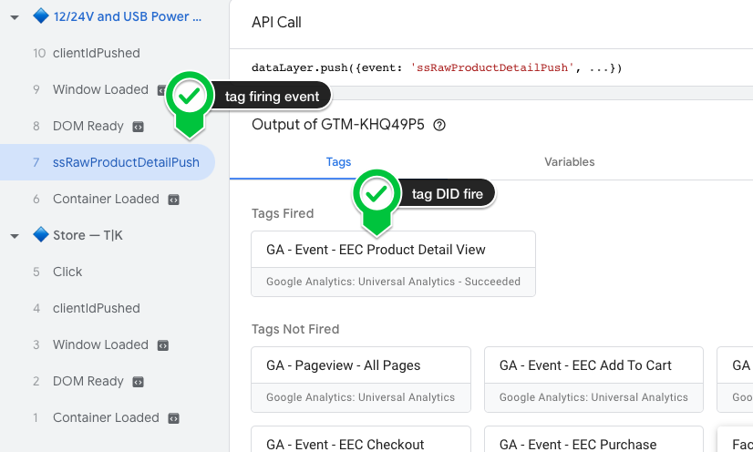
     
4. Click on the tag itself, choose "Show More" to see all the details of the tag, and set the radio button in the upper right corner to "Values"
5. Now verify that all of the information and tag fields are correct
6. Repeat these steps for all of the tags
     
    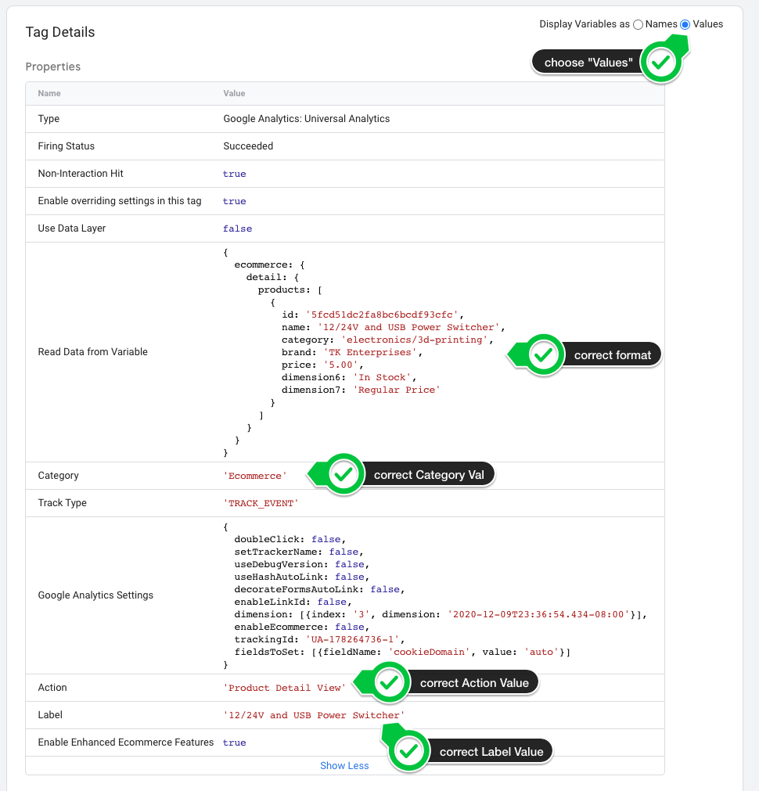
     

