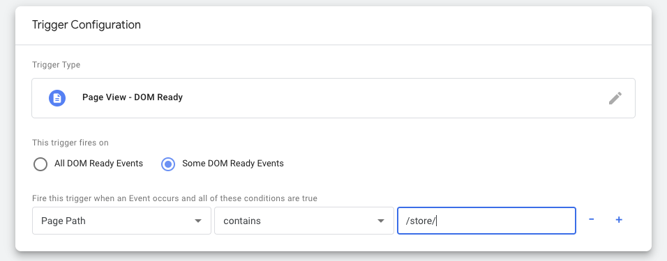

# IMPLEMENTATION GUIDE FOR THE "ADD" EEC ACTION (WHEN ADDING FROM PRODUCT DETAIL PAGE)

1. Setup a trigger that we will use to fire a custom HTML tag
    1. In the GTM "Triggers" section create a new trigger and name it `Dom Ready - Store Pages`
    2. For the "Trigger Configuration" choose "Dom Ready"
    3. Now choose "Some DOM Ready Events"
    4. Select "Page Path" in the first dropdown, "contains" in the second and then type in `/store/` to the text field
    5. Save the trigger

  


2. Setup a custom HTML Tag to to push raw item added data to dataLayer
    1. In the GTM "Tags" section, create a new tag name it `Custom HTML - Push ssRawAddToCart to DL`
    2. For the "Tag Configuration" choose "Custom HTML"
    3. Copy [this code][01_datalayer_push_code] to the "HTML" section
    4. Now under "Triggering" choose the `Dom Ready - Store Pages` trigger we created in the previous step
    5. Save the tag
    6. To test this, re-start Preview mode in GTM, visit a product details page, add the product to cart, and you should see the `ssRawAddToCartPush` event show up in the Summary tab. Click on this event and check the "Variables" tab. The `DL - SS Raw Add To Cart` variable should now be populated with a bunch of data.


3. Use a Custom Javascript Variable to transform the raw data into a `productJSON` and then generate our `add` EEC data structure (add the actionField with list name if applicable)
    1. Create a Custom Javascript Variable and name it `JS - eec.add`
    2. Copy [this code][02_eec_object_creation_code] to the "Custom JavaScript" section
    3. Save the variable
    4. To test this, re-start Preview mode in GTM, visit a product details page, add the product to cart, click on the `ssRawAddToCartPush` event in the Summary tab and check the "Variables" tab. The `JS - eec.add` variable should now be populated with a properly formatted EEC Object. See below for an example of what this looks like.


4. Lastly, we should check to make sure the cookie was properly updated.
    1. To test this, first remove all items from the cart, then re-start Preview mode in GTM, visit a product details page and add the product to cart. If we click on the `ssRawAddToCartPush` event in the Summary tab and check the "Variables" tab. The `Cookie - variantsAddedToCart` variable may be populated or it may appear to be empty. This is normal. Reload the product page, click on any event in the Summary tab after the page has reloaded and we should see the cookie has been populated with an object who's first level key is set to the SKUs of the product that we just added to cart. The cookie will add a new object everytime a new product is added that has not been added before.
    Of course we may have to re-load the page to see it update. Again, this is normal and is just an idiosyncracy with the way Google Tag Manager displays information for each dataLayer event.


**EEC ADD DATA STRUCTURE REFERENCE**<br/>
This is an example of what an EEC data structure for action of type `add` looks like.

```{
  'ecommerce': {
    'add': {
      'products': [
        {
          'id': '399sdccsfjl8990933kkj3jkl3',
          'name': 'product name',
          'category': 'categoryA/categoryB',
          'brand': 'Your Brand Name',
          'metric1': 12,
          'quantity': 2,
          'dimension5': 'SQ1234567',
          'price': '6.00',
          'dimension6': 'In Stock',
          'dimension7': 'On Sale'
        }
      ],
      'actionField': {'list': 'The List Name'}
    }
  }
}
```


[01_datalayer_push_code]: ./01_gtm_rawAddToCartPush.html
[02_eec_object_creation_code]: ./02_gtm_eecAddObj.js


<!-- 
<script>
var productJSON = {
    'productId': newlyAdded.itemId,
    'productName': newlyAdded.title,
    'productCategory': variantAdded.optionValues[0].value,
    'variants':
    [{
        'sku': variantAdded.sku,
        'price': variantPrice.toFixed(2),
        'unlimited': variantAdded.unlimited,
        'qtyInStock': variantAdded.qtyInStock, // can be 0 if unlimited is true
        'onSale': variantAdded.onSale
    }]
}
</script>
 -->